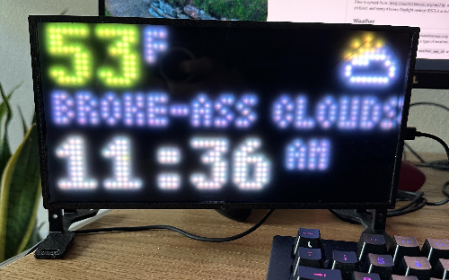

# Matrix Portal Retro-Display

A retro display that shows the time and weather conditions, built on the incredible [Matrix Portal](https://www.adafruit.com/product/4745).




## Time

Time is synced from `http://worldtimeapi.org/api/ip` and uses your IP address to determine the timezone. It syncs on boot, and every 4 hours. Daylight savings (DST) is automatically accounted for.


## Weather

Weather is fetched from `https://api.openweathermap.org`. The weather description will scroll if it doesn't fit, and 6 different icons will be shown for the various type of weather. Weather and temperature is updated every 10 mins.

__You'll need to update `weather_zip` and `weather_app_id` with your own zip code and app id.__


## Spotify

Spotify integration requires that you run a webserver that provides a small amount of JSON. We can't pull data live from Spotify because it doesn't support "headless" apps. The server doesn't need to be local.

In `code.py` you'll have to modify `SPOTIFY_URL` to point to the endpoint that provides the data. The format should be:
```
{
    'name' : 'name of song',
    'artist' : 'name of artist'
}
```